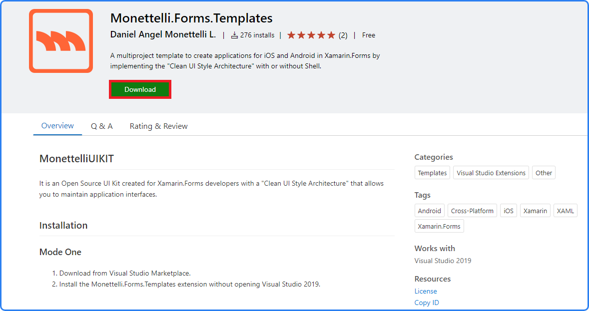

# Focus on creating beautiful interfaces in Xamarin.Forms
{: .fs-9 }

That the **FREE MonettelliUIKIT** extension takes care of productivity and maintenance thanks to the **"Clean UI Style Architecture"**.
{: .fs-6 .fw-300 }

[Download the extension now](https://marketplace.visualstudio.com/items?itemName=DanielMonettelli.monettelli-forms-templates){: .btn .btn-primary .fs-5 .mb-4 .mb-md-0 .mr-2 } [View it on GitHub](https://github.com/danielmonettelli/MonettelliUIKIT){: .btn .fs-5 .mb-4 .mb-md-0 }

---

---

## Installation

### Mode One

1. Download from Visual Studio Marketplace.
2. Install the Monettelli.Forms.Templates extension without opening Visual Studio 2019.

---

---

### Mode Two

1. Download from Visual Studio 2019.
2. Close the Visual Studio 2019 IDE.
3. Wait a while, then click to “Modify”, when the process is finished click on “Close”.

---
